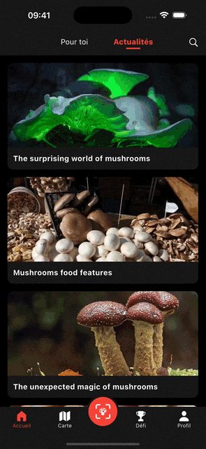
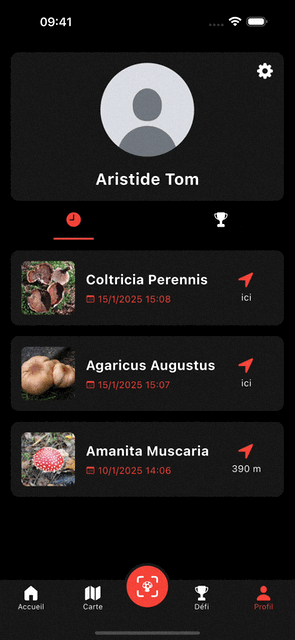
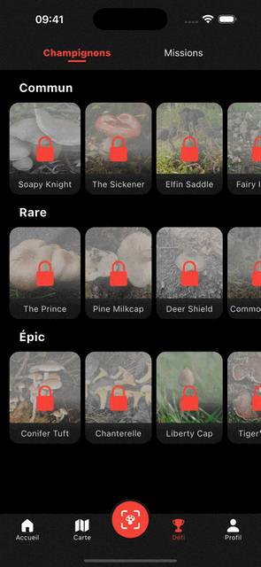
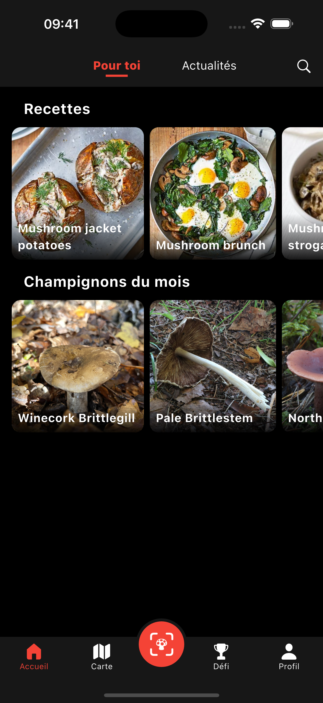
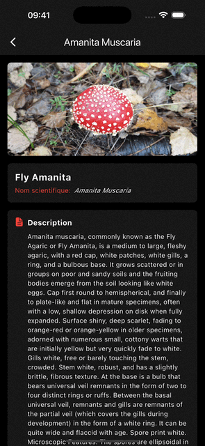
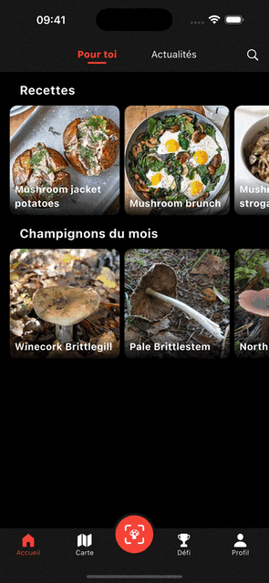
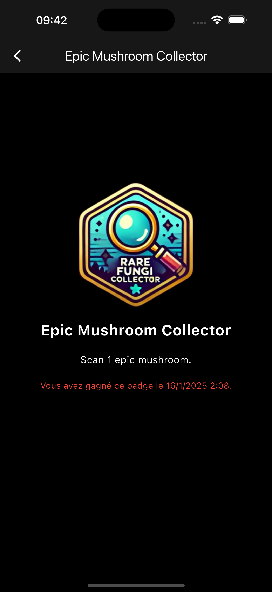
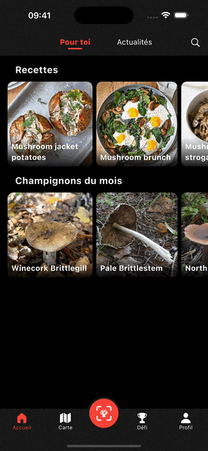
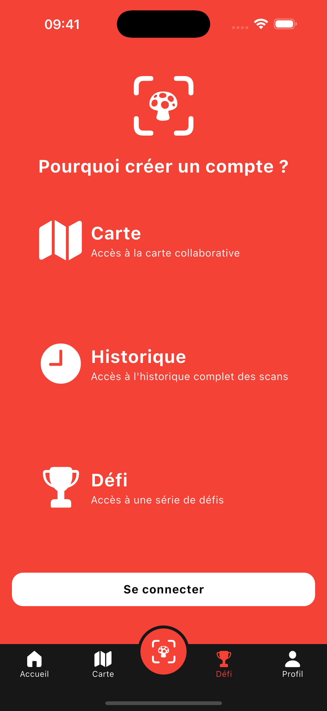
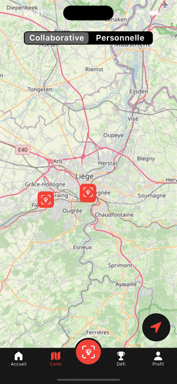

# MushroomGO 🍄

MushroomGO est une application mobile innovante dédiée à l’identification et à la collecte de champignons. L’objectif principal est d’aider et d'accompagner les amateurs de champignons, les mycologues amateurs/confirmés, ou les simples curieux à explorer, identifier, et partager leurs découvertes.

---

## 📂 Structure du projet

### Principaux dossiers :
- **`/lib`** : Contient tout le code source Flutter structuré par fonctionnalités.
    - **`/constant`** : Définit les constantes globales utilisées dans toute l'application (dimensions, couleurs, Styles, etc...).
    - **`/exception`** : Contient les exceptions personnalisées.
    - **`/l10n`** : Contient les fichiers la traduction de l'application (anglais et français uniquement).
    - **`/models`** : Classes représentant les données principales (les missions, les champignons, les recettes, les scans, etc...).
    - **`/provider`** : Gère les providers pour l'état global de l'application, la langue et le thème (clair, sombre).
    - **`/screen`** : Contient les différentes pages, widget et tab. Tout ce qui va apparaitre à l'écran lors de l'utilisation de l'application.
    - **`/theme`** : Contient les différents thèmes utilisés dans l’application, un thème contient des couleurs, des styles ainsi que des variables.
    - **`/utils`** : Regroupe des outils génériques et spécifiques comme les méthodes pour intéragir avec Firestore, l'API, la localisation, etc...
- **`/assets`** : Contient les ressources utilisées dans l'application.
    - **`/images`** : Contient les différentes images, icons, gifs utilisés dans l'application.
    - **`/fonts`** : Contient notre police personnalisée utilisée dans l'application.

---

## 🎯 Présentation de l'application

### MushroomGO répond à un besoin :
Identifier facilement les champignons trouvés lors de balades, randonnées ou cueillette. Notre application propose une expérience ludique, éducative et challengeante. Celle-ci permet :
- Identification des champignons : Prenez une photo et identifiez facilement les champignons rencontrés, avec des informations détaillées sur leur classification, leur comestibilité, et bien plus.
- Explorer une carte collaborative : Découvrez une carte collaborative mettant en évidence des zones et des repères spécifiques pour les champignons identifiés par les utilisateurs de l'application.
- Déverrouiller des champignons challenge : Participez à des défis en débloquant des champignons communs, rares et épiques lors de vos balades.
- Accomplir des missions : Gagnez des badges en complétant des missions hebdomadaires ou mensuelles basées sur la rareté ou les familles de champignons.
- Recevoir des suggestions de recettes : Découvrez des idées de recettes, idéal pour les amateurs de cuisine.
- Articles : Accédez à des articles instructifs sur les champignons, leurs écosystèmes et leur utilisation, proposés régulièrement.

MushroomGO a été développé avec l'objectif de rendre la mycologie accessible à tous, challenger et divertir les utilisateurs tout en leur faisant découvrir le monde fantastique des champignons.

---

## 🔍 Étude de l’existant

| Application              | Points forts                                                                                 | Points faibles                                                                                                                                                 |
|--------------------------|----------------------------------------------------------------------------------------------|----------------------------------------------------------------------------------------------------------------------------------------------------------------|
| **PictureMushrroms**     | - Interface moderne et épurée, cette application remplit toutes les fonctionnalités de base. | - Malgré que les fonctionnalités de bases soient remplies, on a tendance à se lasser vite, il manque une dose de gamification pour fidéliser les utilisateurs. |
| **MushroomsIdenticator** | - Se démarque par ses quizzs et les questions que l'on peut adresser à la communauté.        | - Interface vieillissante et peu intuitive.                                                                                                                    | |

Ces applications couvrent certains besoins d’identification, mais MushroomGO se démarque par sa carte collaborative, ses sources de données diverses avec ses suggestions d'articles et de recettes ainsi que sa gamification avancée notamment grâce aux missions/badges et aux champignons challenges.

---

## 👥 Public cible
MushroomGO s'adresse à un public diversifié, voici un aperçu des profils ciblés :

- Débutants en mycologie : Des utilisateurs curieux de découvrir le monde des champignons mais n'ayant pas encore de connaissances spécifiques.
- Passionnés de mycologie : Des experts ou amateurs confirmés souhaitant identifier des champignons, enrichir leurs connaissances et partager leurs découvertes.
- Randonneurs et explorateurs : Des personnes qui aiment explorer la nature et souhaitent identifier les champignons qu'ils croisent.
- Familles : Parents souhaitant proposer une activité ludique et éducative lors des sorties en nature.
- Amateurs de cuisine : Cuisiniers amateurs cherchant à intégrer des champignons à leurs recettes ou à découvrir des variétés comestibles.

Pour répondre aux besoins variés de notre public cible, nous avons intégré plusieurs fonctionnalités et concepts clés :

- Accessibilité pour tous les niveaux : MushroomGO est pensée pour les débutants comme pour les experts en mycologie. L'identification intuitive et les informations détaillées permettent à chacun d'y trouver son compte.
- Personnalisation de l'expérience : Les missions, challenges et suggestions de contenu sont adaptés en fonction des intérêts de l'utilisateur (abandonné par manque de temps).
- Apprentissage ludique et challengeant : La gamification avec des badges, missions et champignons à débloquer motive les utilisateurs à explorer davantage tout en apprenant.
- Approche éducative: Des fonctionnalités comme l'identification et les articles éducatifs permettent de transformer une balade en forêt en une activité enrichissante.
- Inspiration culinaire : Une section dédiée aux recettes apporte une valeur ajoutée pour les amateurs de cuisine, en associant directement leurs découvertes à des idées pratiques.
- Communauté et collaboration : L'intégration de fonctions communautaires favorise le partage de découvertes, renforçant l'aspect social et motivant les utilisateurs à contribuer activement.

---

## ✨ Fonctionnalités

### user stories :
- Tom, 26 ans, randonneur occasionnel, cherche à identifier les champignons trouvés lors de ses balades.
- Simon, 40 ans, passionné de mycologie, utilise l’application pour cartographier ses découvertes et les partager à la communauté.
- Emma, 32 ans, mère de deux enfants, souhaite transformer leurs sorties en forêts en une activité éducative.
- Zoé, 18 ans, aime relever des défis, elle prend goût aux challenges et aux missions, elle découvre le monde des champignons.
- Maxime, 27 ans, passionné de cuisine, se sert de notre application pour trouver des idées originales et innovantes pour ses plats.

---

## 🚧 État d’avancement

| Fonctionnalités                                 | État       | Illustration                      |
|-------------------------------------------------|------------|-----------------------------------|
| Navigation                                      | Terminé    |  |
| Settings page (theme, internalisation & privacy/terms_conditions page) | Terminé    |  |
| Profil page (history)                          | Terminé    |  |
| Challenge page (mushrooms & missions) | Terminé    |  |
| Home for you page                               | Terminé    |  |
| Authentification (account page, registration & login) | Terminé    |  |
| Mushroom detail page                            | Terminé    |  |
| Web view page pour les articles et les recettes | Terminé    |  |
| Camera page |  |  |
| Badge detail page                  | Terminé    |  |
| Search page                 | Terminé    |  |
| Benefit account page                            | Terminé    |  |
| Carte interactive                               | Terminé |  |

---

## 📖 Guide pour développeurs

### Prérequis :
- **Flutter SDK** : Version 3.5.4 ou supérieure.
- **Clé API** :
  1. **Créer un compte sur Kindwise Mushroom ID** :
     - Rendez-vous sur [Kindwise Mushroom ID](https://www.kindwise.com/mushroom-id).
     - Inscrivez-vous avec votre adresse email ou connectez-vous si vous avez déjà un compte.
     - Générez une nouvelle clé API. Copiez cette clé.
     - Collez la clé dans le fichier mushroom_identification_utils.dart
---
⚠️ Nous sommes au courant que les API keys doivent être stockées de manière sécurisée, c'est à dire autre part que dans le code mais dans le cadre du projet, nous ne nous sommes pas concentré sur cet aspect donc l'api key est stockée dans le code se trouvant sur github.

### Étapes pour compiler et exécuter le projet :
1. **Cloner le projet** :
   ```bash
   git clone https://github.com/AristideLambert/MushroomGO.git
   ```
2. **Démarrer le projet** :
    ````bash
    cd MushroomGO/MushroomGO/
    flutter pub get
    flutter run